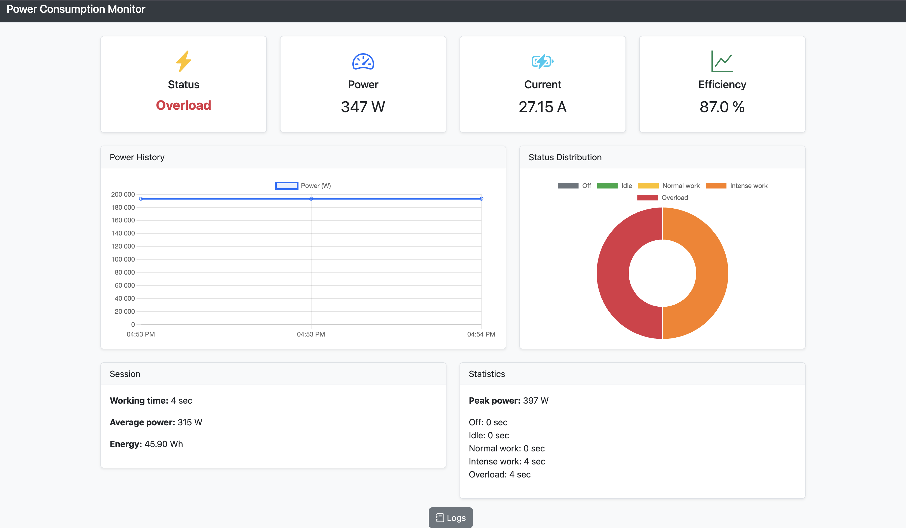
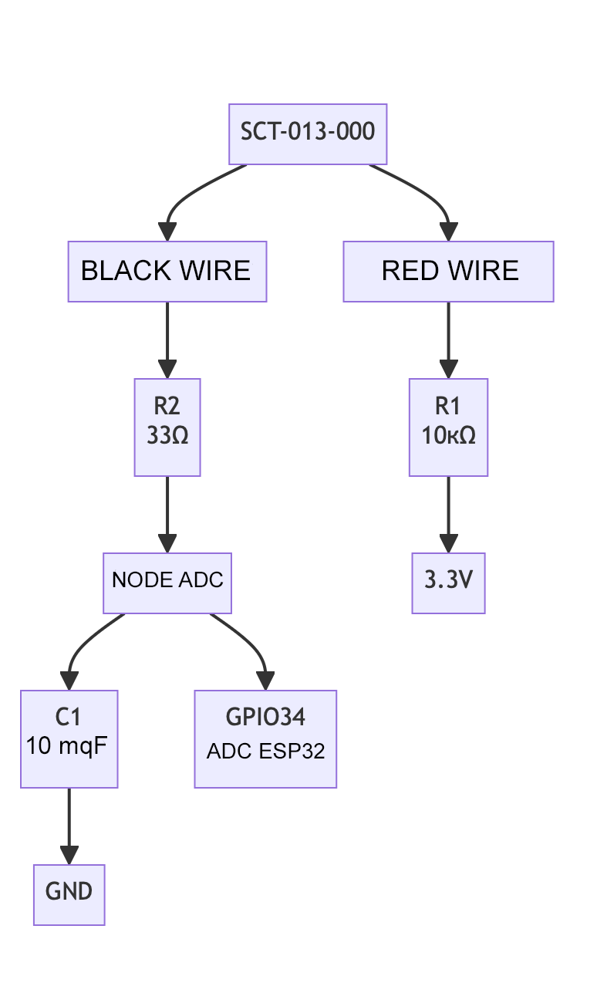

# ⚡ ESP32 Power Monitoring with Web Interface

[](https://www.espressif.com/)
[](https://www.arduino.cc/)
[](LICENSE)
[](README.md)
[](README_RU.md)

>💬 Переключитесь на русскую версию — [Русский](README_RU.md) 
 
---

**A professional energy consumption monitoring system** that transforms your ESP32 into an autonomous power monitor with a beautiful web interface. Track the power usage of any household appliance in real time with industrial precision — no subscriptions, clouds, or extra apps required.

---
 
## 🎥 Live Demo

### 🖥️ Real-Time Web Interface

*Data updates every 2 seconds: power, device state, consumption history, efficiency, and peak loads.*

### 🔌 Hardware Connection


## 🚀 Why This Project?

Tired of expensive monitors with limited features? This **open-source solution** gives you:

- **💰 Cost Savings** — under 15$ for all components
- **🔧 Full Control** — customize everything: add sensors, tweak algorithms
- **🌐 No Cloud Required** — your data stays on your local network
- **📊 Professional Analytics** — True RMS, state detection, efficiency tracking, historical graphs
- **⚡ Instant Feedback** — see changes in power usage immediately

---

## ✨ Key Features

| Feature | Description | Benefit |
|--------|-------------|---------|
| **🔍 True RMS Calculation** | Accurate power calculation using root-mean-square formula | Works with any load — even non-sinusoidal (LEDs, inverters, electronic ballasts) |
| **🤖 Automatic State Detection** | Identifies 5 distinct operating modes of connected devices | Know when your kettle is on, and when it’s just “asleep” |
| **🌐 Built-in Web Server** | Interface works on any device — phone, tablet, PC | No app installation required |
| **📊 Live Analytics** | Graphs, efficiency, peak loads, session energy totals | Make decisions based on data, not guesses |
| **🔧 Simple Calibration** | Calibrate using a known load | Accuracy up to ±2% after calibration |
| **⚙️ REST API** | Full data access via HTTP requests | Integrates with Home Assistant, Node-RED, Grafana, MQTT |

---

## 🏗️ How It Works

```
Physical Layer → Processing → Web Interface
       ↓                ↓               ↓
Current Sensor → ESP32 (ADC + Logic) → Your Browser
```

1. **Signal Acquisition**: The SCT-013-000 current sensor is clamped around the live wire, converting current into a proportional voltage.
2. **Analog Conditioning**: A voltage divider (10kΩ + 33Ω) scales the signal down to a safe 0–3.3 V range for the ESP32’s ADC.
3. **Digital Processing**: The ESP32 samples the voltage 1000 times per second, computes True RMS, and multiplies by mains voltage (220 V) to get real power in watts.
4. **State Recognition**: Algorithm classifies device behavior into 5 modes: Off, Idle, Normal Operation, Intensive Operation, High Load.
5. **Data Delivery**: Built-in web server serves HTML interface and JSON data via API.
6. **Live Updates**: Interface refreshes every 2 seconds — no page reloads needed.

---

## 🛠️ Quick Start (5 Minutes)

### What You Need

| Component | Cost | Notes |
|----------|------|-------|
| ESP32 DevKit (or equivalent) | 8$ | Any version: ESP32-WROOM, ESP32-S3 |
| SCT-013-000 Current Sensor (100A) | 4$ | Do NOT confuse with 5A version! |
| Resistors: 10kΩ and 33Ω | 0.2$ | For voltage divider |
| Breadboard and jumper wires | 1.5$| Can use pre-made cables |
| USB cable | — | Already have one? |

> 💡 **Important**: Working with 220 V AC is **dangerous**! If unsure, ask a qualified electrician. The sensor **does not touch wires** — it merely clamps around the live conductor.

### Flashing the Firmware

#### Option 1: Arduino IDE

1. **Add ESP32 to Arduino IDE**:
   - `File → Preferences → Additional Boards Manager URLs`:  
     `https://espressif.github.io/arduino-esp32/package_esp32_index.json`
   - `Tools → Board → Boards Manager` → search for `esp32` → install `ESP32 by Espressif Systems`

2. **Open the firmware**:  
   `firmware/english_version/ESP32_Monitoring_system_en.ino`

3. **Configure Wi-Fi**:  
   Find in code:
   ```cpp
   const char* ssid = "Your_WiFi_Name";
   const char* password = "Your_WiFi_Password";
   ```
   Replace with your network credentials.

4. **Upload the code**:  
   - Select board: `ESP32 Dev Module`  
   - Select port (COM on Windows, /dev/ttyUSB on Linux/macOS)  
   - Click **Upload**

#### Option 2: PlatformIO (Recommended)

1. Install **VS Code** + **PlatformIO IDE** extension
2. Open the project folder in VS Code
3. PlatformIO auto-detects the project
4. Open `firmware/*_version/ESP32_Monitoring_system_*.ino` → update Wi-Fi settings
5. Click **Upload** (green triangle button)

### Running and Using

1. Open **Serial Monitor** at **115200 baud**
2. Wait for message:  
   `Web server started on IP: 192.168.1.100`
3. Open browser → enter that IP address
4. **Done!** You now see the live interface — turn any device on/off to see changes.

---

## 💡 Ideal Use Cases

| Domain | Application |
|--------|-------------|
| **🏠 Home** | Monitor fridge, washing machine, water heater, AC — find “energy vampires” |
| **💻 Office** | Analyze PC, server, monitor power use — optimize costs |
| **🔧 DIY / Education** | Learn physics of current, power, data analysis — perfect for schools and universities |
| **🏭 Industrial** | Monitor motors, pumps, fans — detect failures via rising power consumption |
| **🔋 Energy Audit** | Calculate monthly cost per appliance — discover what’s *really* draining electricity |

---

## 🔧 Advanced Features

### 🤖 Automatic State Recognition

The system automatically classifies devices into 5 states:

| State | Power Range | Example |
|-------|-------------|---------|
| **Off** | 0–0.5 W | TV in standby |
| **Idle** | 1–10 W | Charger without device |
| **Normal Operation** | 11–200 W | LED bulb, router, laptop |
| **Intensive Operation** | 201–1500 W | Kettle, iron, vacuum |
| **High Load** | >1500 W | Washing machine spin cycle, electric stove |

> 💡 **Bonus**: Adjust thresholds in code to match your devices!

### 📊 Analytics & History

- **Sessions**: Tracks runtime and total energy consumed per activation
- **Efficiency**: Calculates power factor (if voltage is known)
- **Peaks**: Shows daily/weekly maximum power draw
- **History**: Stores last 100 measurements with timestamps (circular buffer)

### ⚙️ REST API — Smart Home Integration

Access data via HTTP endpoints:

| Endpoint | Data | Example |
|----------|------|---------|
| `/api/data` | Current values | `{"power": 124.5, "state": "Operation", "current": 0.56, "energy": 34.2}` |
| `/api/history` | Last 100 readings | JSON array with timestamps |
| `/api/statistics` | Session summary | `{"total_kWh": 0.12, "runtime_minutes": 45, "peak_w": 1450}` |

Use with **Home Assistant** via `REST Sensor` or in **Node-RED** via `http request`.

---

## 🎯 Accuracy and Calibration

- **After calibration**: **±2% or better**

### How to Calibrate (Simple!)

1. Connect a **known load** — e.g., a 100 W incandescent bulb.
2. Turn it on and note the reading on the web interface — say, **92 W**.
3. Calculate calibration factor:  
   `calibration_factor = 100 / 92 ≈ 1.087`
4. Open the code → find this line:  
   `float calibration_factor = 1.0;`
5. Replace with:  
   `float calibration_factor = 1.087;`
6. Reboot ESP32 — readings are now accurate!

> 💡 **Tip**: Calibrate at stable mains voltage (220–230 V). Avoid LED bulbs — they distort waveform.

---

## 🌍 Choose Your Language

- **[English Documentation](README.md)** — ✅ You're here — complete, detailed, with examples
- **[Russian Documentation](README_RU.md)** — Full version in Russian 

> ✅ **Both versions contain identical content** — just in different languages. Pick your preference.

---

## 🤝 How You Can Help

You can make this project better!

| How to Help | What to Do |
|-------------|------------|
| **💡 Suggest an Improvement** | Discuss ideas in [Discussions]((https://github.com/Maxim-szh/ESP32-Power-Monitor-WebServer/discussions/4)) |
| **📖 Improve Documentation** | Translate, simplify, add diagrams |
| **📸 Share Your Build** | Upload photos/videos — we’ll feature them in the gallery |
| **⭐ Star on GitHub** | Helps the project grow! |

### Quick Contribution Workflow:

```bash
git clone https://github.com/your-username/esp32-power-monitor.git
cd esp32-power-monitor
# Make changes (e.g., fix typo in README.md)
git add README.md
git commit -m "fix: corrected typo in calibration section"
git push origin main
# Create a Pull Request on GitHub
```

---

## 📜 License

This project is licensed under **MIT** — you may:

- ✅ Use for personal or commercial purposes
- ✅ Modify the code
- ✅ Distribute
- ✅ Omit attribution (though we’d appreciate a mention!)

Full license text: [LICENSE](LICENSE)

---

## ❓ Frequently Asked Questions

**Q: Is it safe to use with 220 V AC?**  
A: **Yes!** The SCT-013-000 is **non-invasive** — it only clamps around the wire. **However**, when assembling the voltage divider, **do not touch exposed conductors**.

**Q: Do I need programming experience?**  
A: No. Instructions are written for beginners. If you can copy-paste text, you can complete this project.

**Q: Can I monitor multiple devices at once?**  
A: Yes! Connect multiple sensors to different ESP32 ADC pins (GPIO34, 35, 36, 39). Extend the code to handle each sensor.

**Q: What’s the maximum current the sensor can measure?**  
A: SCT-013-000 supports up to **100 A** — more than enough for any household appliance, including electric stoves or water heaters.

**Q: Can I connect to 5 GHz Wi-Fi?**  
A: No. ESP32 only supports **2.4 GHz** networks. Ensure your router broadcasts on 2.4 GHz.

---

## 🔗 Useful Links

| Link | Description |
|------|-------------|
| [💬 Discussions](https://github.com/Maxim-szh/ESP32-Power-Monitor-WebServer/discussions/4) | Get help, share ideas, case studies |
| [⭐ Star on GitHub](https://github.com/Maxim-szh/ESP32-Power-Monitor-WebServer/stargazers) | Support the project! |
| [🔧 English Firmware](firmware/english_version/ESP32_Monitoring_system_en.ino) | Firmware with English comments |
